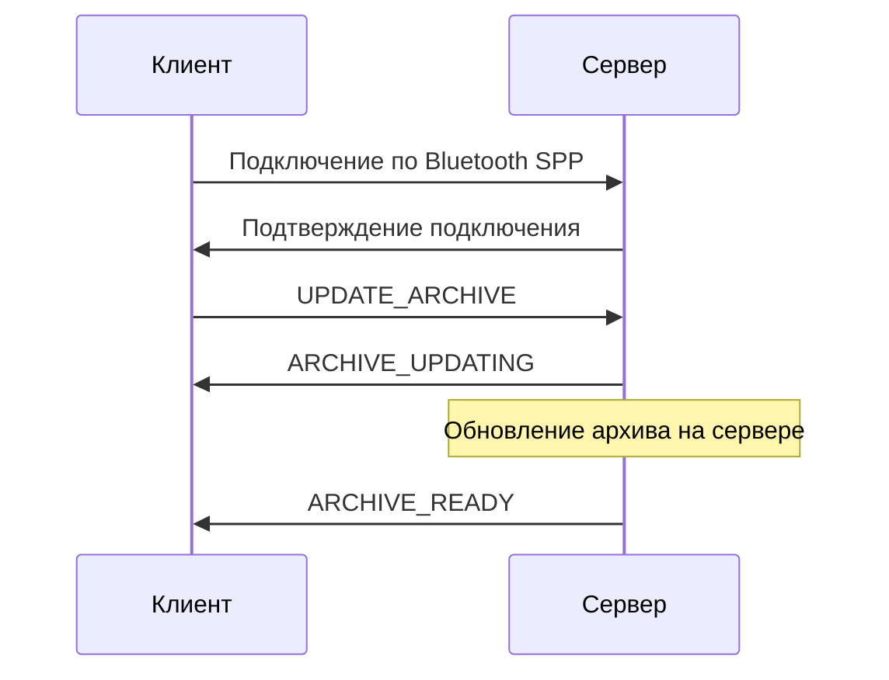
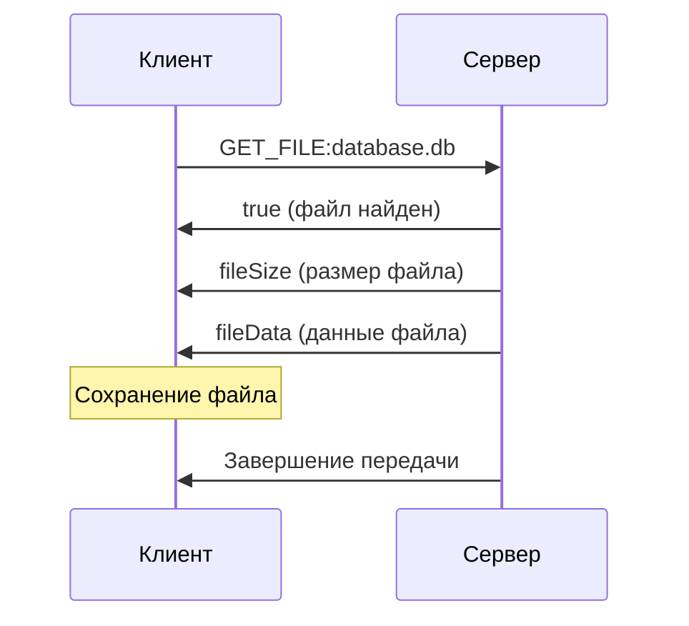

# Bluetooth SPP Протокол - Документация

## Обзор

Данный документ описывает протокол взаимодействия между Flutter-клиентом и Android-сервером по Bluetooth SPP (Serial Port Profile).

## Архитектура

```
┌─────────────────┐    Bluetooth SPP    ┌─────────────────┐
│   Flutter App   │ ◄─────────────────► │  Android Server │
│   (Клиент)      │                     │   (Сервер)      │
└─────────────────┘                     └─────────────────┘
```

## Поддерживаемые команды

### 1. Обновление архива

| Команда | Направление | Описание |
|---------|-------------|----------|
| `UPDATE_ARCHIVE` | Клиент → Сервер | Запрос на обновление архива БД на сервере |
| `ARCHIVE_UPDATING` | Сервер → Клиент | Уведомление о начале обновления архива |
| `ARCHIVE_READY` | Сервер → Клиент | Уведомление о готовности архива |

### 2. Передача файлов

| Команда | Направление | Описание |
|---------|-------------|----------|
| `GET_FILE:<имя_файла>` | Клиент → Сервер | Запрос на скачивание файла |

## Формат данных

### Структура кадра
```
┌─────────────┬─────────────┐
│  2 байта    │   N байт    │
│   длина     │   данные    │
│ (big-endian)│  (UTF-8)    │
└─────────────┴─────────────┘
```

### Формат передачи файла
```
┌─────────────┬─────────────┬─────────────┐
│  1 байт     │   8 байт    │   N байт    │
│  success    │  fileSize   │  fileData   │
│  (boolean)  │   (long)    │   (bytes)   │
└─────────────┴─────────────┴─────────────┘
```

## Последовательность операций

### 1. Подключение и обновление архива



### 2. Скачивание файла



## Детальное описание операций

### Шаг 1: Инициализация
1. **Сервер** запускается как foreground service
2. **Сервер** создает BluetoothServerSocket с UUID `00001101-0000-1000-8000-00805F9B34FB`
3. **Сервер** ожидает подключений клиентов

### Шаг 2: Поиск устройств
1. **Клиент** сканирует Bluetooth устройства
2. **Клиент** фильтрует устройства по шаблону `Quantor A00AA00`
3. **Клиент** автоматически подключается к найденному устройству

### Шаг 3: Обновление архива
1. **Клиент** отправляет команду `UPDATE_ARCHIVE`
2. **Сервер** отвечает `ARCHIVE_UPDATING`
3. **Сервер** уведомляет Android-приложение о необходимости обновить БД
4. **Сервер** отправляет `ARCHIVE_READY` когда файл готов

### Шаг 4: Скачивание файла
1. **Клиент** отправляет `GET_FILE:database.db`
2. **Сервер** проверяет наличие файла
3. **Сервер** отправляет `true` + размер файла + данные файла
4. **Клиент** сохраняет файл локально

## Обработка ошибок

### Типичные ошибки
- **Файл не найден**: Сервер отправляет `false`
- **Соединение потеряно**: Автоматическое переподключение (до 3 попыток)
- **Таймаут**: 15 секунд для команд, 100 секунд для передачи файлов

### Механизмы восстановления
- **Retry логика**: Повторные попытки с экспоненциальной задержкой
- **Буферизация**: 8KB буфер для передачи данных
- **Flush**: Принудительная отправка каждые 32KB

## Состояния приложения

### Клиентские состояния
- `BluetoothInitial` - Начальное состояние
- `BluetoothScanning` - Поиск устройств
- `BluetoothConnected` - Подключено к устройству
- `ArchiveUpdatingState` - Архив обновляется
- `ArchiveReadyState` - Архив готов
- `FileDownloading` - Скачивание файла

### Серверные состояния
- `ServerStarted` - Сервер запущен
- `ClientConnected` - Клиент подключен
- `TransferStarted` - Начата передача
- `TransferProgress` - Прогресс передачи
- `TransferCompleted` - Передача завершена

## Конфигурация

### Параметры клиента
- **UUID сервиса**: `00001101-0000-1000-8000-00805F9B34FB`
- **Размер буфера**: 8KB
- **Таймаут подключения**: 15 секунд
- **Максимум попыток**: 3

### Параметры сервера
- **Имя сервиса**: `BluetoothFileTransfer`
- **Размер буфера**: 8KB
- **Частота flush**: каждые 32KB
- **Send buffer**: 64KB (если поддерживается)

## Логирование

### Клиентские логи
- Поиск устройств
- Подключение/отключение
- Отправка команд
- Прогресс скачивания

### Серверные логи
- Запуск/остановка сервера
- Подключение клиентов
- Обработка команд
- Прогресс передачи

## Безопасность

- **Разрешения**: Bluetooth, Location, Storage
- **Валидация**: Проверка имени файла
- **Ограничения**: Только файлы .db и .db.gz
- **Изоляция**: Каждое соединение в отдельном потоке 